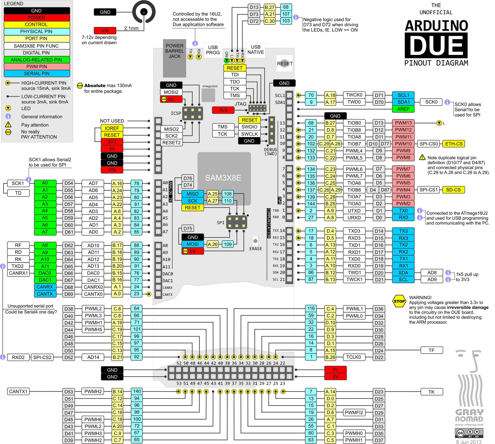

Arduino Due
===========

Pinout
------

Default system features
-----------------------

The default configuration includes those major features. They are all
initialized by ``sys_start()`` at the startup of the application.

- :doc:`Console.<../library-reference/oam/console>`
- File system.
- :doc:`Debug shell.<../library-reference/oam/shell>`

Drivers
-------

Supported drivers for this board.

- :doc:`../library-reference/drivers/adc`
- :doc:`../library-reference/drivers/analog_input_pin`
- :doc:`../library-reference/drivers/can`
- :doc:`../library-reference/drivers/chipid`
- :doc:`../library-reference/drivers/dac`
- :doc:`../library-reference/drivers/exti`
- :doc:`../library-reference/drivers/flash`
- :doc:`../library-reference/drivers/i2c_soft`
- :doc:`../library-reference/drivers/mcp2515`
- :doc:`../library-reference/drivers/pin`
- :doc:`../library-reference/drivers/sd`
- :doc:`../library-reference/drivers/spi`
- :doc:`../library-reference/drivers/uart`
- :doc:`../library-reference/drivers/usb`
- :doc:`../library-reference/drivers/usb_host`

Library Reference
-----------------

Read more about board specific functionality in the :doc:`Arduino Due
<../library-reference/boards/arduino_due>` module documentation in the
Library Reference.

Memory usage
------------

Below is the memory usage of two applications:

- The
  :github-tree:`minimal-configuration<examples/minimal-configuration>`
  application is configured to only include the bare minimum of
  functionality for the low level kernel to run. That is, the
  thread scheduler and system tick.

- The
  :github-tree:`default-configuration<examples/default-configuration>`
  application is built with the default configuration, including a lot
  more functionality. See the list of `Default system features`_ above
  for a summary.

+--------------------------+-----------+-----------+
| Application              | Flash     | RAM       |
+==========================+===========+===========+
| minimal-configuration    |     19904 |      5264 |
+--------------------------+-----------+-----------+
| default-configuration    |     93312 |     10950 |
+--------------------------+-----------+-----------+

Default configuration
---------------------

Default Standard Library configuration.

+--------------------------------------------------------+-----------------------------------------------------+
|  Name                                                  |  Value                                              |
+========================================================+=====================================================+
|  CONFIG_ASSERT_                                        |  1                                                  |
+--------------------------------------------------------+-----------------------------------------------------+
|  CONFIG_DEBUG_                                         |  1                                                  |
+--------------------------------------------------------+-----------------------------------------------------+
|  CONFIG_FS_CMD_DS18B20_LIST_                           |  1                                                  |
+--------------------------------------------------------+-----------------------------------------------------+
|  CONFIG_FS_CMD_FS_APPEND_                              |  1                                                  |
+--------------------------------------------------------+-----------------------------------------------------+
|  CONFIG_FS_CMD_FS_COUNTERS_LIST_                       |  1                                                  |
+--------------------------------------------------------+-----------------------------------------------------+
|  CONFIG_FS_CMD_FS_COUNTERS_RESET_                      |  1                                                  |
+--------------------------------------------------------+-----------------------------------------------------+
|  CONFIG_FS_CMD_FS_FILESYSTEMS_LIST_                    |  1                                                  |
+--------------------------------------------------------+-----------------------------------------------------+
|  CONFIG_FS_CMD_FS_FORMAT_                              |  1                                                  |
+--------------------------------------------------------+-----------------------------------------------------+
|  CONFIG_FS_CMD_FS_LIST_                                |  1                                                  |
+--------------------------------------------------------+-----------------------------------------------------+
|  CONFIG_FS_CMD_FS_PARAMETERS_LIST_                     |  1                                                  |
+--------------------------------------------------------+-----------------------------------------------------+
|  CONFIG_FS_CMD_FS_READ_                                |  1                                                  |
+--------------------------------------------------------+-----------------------------------------------------+
|  CONFIG_FS_CMD_FS_WRITE_                               |  1                                                  |
+--------------------------------------------------------+-----------------------------------------------------+
|  CONFIG_FS_CMD_I2C_READ_                               |  1                                                  |
+--------------------------------------------------------+-----------------------------------------------------+
|  CONFIG_FS_CMD_I2C_WRITE_                              |  1                                                  |
+--------------------------------------------------------+-----------------------------------------------------+
|  CONFIG_FS_CMD_LOG_LIST_                               |  1                                                  |
+--------------------------------------------------------+-----------------------------------------------------+
|  CONFIG_FS_CMD_LOG_PRINT_                              |  1                                                  |
+--------------------------------------------------------+-----------------------------------------------------+
|  CONFIG_FS_CMD_LOG_SET_LOG_MASK_                       |  1                                                  |
+--------------------------------------------------------+-----------------------------------------------------+
|  CONFIG_FS_CMD_NETWORK_INTERFACE_LIST_                 |  1                                                  |
+--------------------------------------------------------+-----------------------------------------------------+
|  CONFIG_FS_CMD_PING_PING_                              |  1                                                  |
+--------------------------------------------------------+-----------------------------------------------------+
|  CONFIG_FS_CMD_PIN_READ_                               |  1                                                  |
+--------------------------------------------------------+-----------------------------------------------------+
|  CONFIG_FS_CMD_PIN_SET_MODE_                           |  1                                                  |
+--------------------------------------------------------+-----------------------------------------------------+
|  CONFIG_FS_CMD_PIN_WRITE_                              |  1                                                  |
+--------------------------------------------------------+-----------------------------------------------------+
|  CONFIG_FS_CMD_SERVICE_LIST_                           |  1                                                  |
+--------------------------------------------------------+-----------------------------------------------------+
|  CONFIG_FS_CMD_SERVICE_START_                          |  1                                                  |
+--------------------------------------------------------+-----------------------------------------------------+
|  CONFIG_FS_CMD_SERVICE_STOP_                           |  1                                                  |
+--------------------------------------------------------+-----------------------------------------------------+
|  CONFIG_FS_CMD_SETTINGS_LIST_                          |  1                                                  |
+--------------------------------------------------------+-----------------------------------------------------+
|  CONFIG_FS_CMD_SETTINGS_READ_                          |  1                                                  |
+--------------------------------------------------------+-----------------------------------------------------+
|  CONFIG_FS_CMD_SETTINGS_RESET_                         |  1                                                  |
+--------------------------------------------------------+-----------------------------------------------------+
|  CONFIG_FS_CMD_SETTINGS_WRITE_                         |  1                                                  |
+--------------------------------------------------------+-----------------------------------------------------+
|  CONFIG_FS_CMD_SYS_CONFIG_                             |  1                                                  |
+--------------------------------------------------------+-----------------------------------------------------+
|  CONFIG_FS_CMD_SYS_INFO_                               |  1                                                  |
+--------------------------------------------------------+-----------------------------------------------------+
|  CONFIG_FS_CMD_SYS_UPTIME_                             |  1                                                  |
+--------------------------------------------------------+-----------------------------------------------------+
|  CONFIG_FS_CMD_THRD_LIST_                              |  1                                                  |
+--------------------------------------------------------+-----------------------------------------------------+
|  CONFIG_FS_CMD_THRD_SET_LOG_MASK_                      |  1                                                  |
+--------------------------------------------------------+-----------------------------------------------------+
|  CONFIG_FS_CMD_USB_DEVICE_LIST_                        |  1                                                  |
+--------------------------------------------------------+-----------------------------------------------------+
|  CONFIG_FS_CMD_USB_HOST_LIST_                          |  1                                                  |
+--------------------------------------------------------+-----------------------------------------------------+
|  CONFIG_FS_PATH_MAX_                                   |  64                                                 |
+--------------------------------------------------------+-----------------------------------------------------+
|  CONFIG_MONITOR_THREAD_                                |  1                                                  |
+--------------------------------------------------------+-----------------------------------------------------+
|  CONFIG_PREEMPTIVE_SCHEDULER_                          |  0                                                  |
+--------------------------------------------------------+-----------------------------------------------------+
|  CONFIG_PROFILE_STACK_                                 |  1                                                  |
+--------------------------------------------------------+-----------------------------------------------------+
|  CONFIG_SETTINGS_AREA_SIZE_                            |  256                                                |
+--------------------------------------------------------+-----------------------------------------------------+
|  CONFIG_SHELL_COMMAND_MAX_                             |  64                                                 |
+--------------------------------------------------------+-----------------------------------------------------+
|  CONFIG_SHELL_HISTORY_SIZE_                            |  768                                                |
+--------------------------------------------------------+-----------------------------------------------------+
|  CONFIG_SHELL_MINIMAL_                                 |  0                                                  |
+--------------------------------------------------------+-----------------------------------------------------+
|  CONFIG_SHELL_PROMPT_                                  |  "$ "                                               |
+--------------------------------------------------------+-----------------------------------------------------+
|  CONFIG_SPIFFS_                                        |  1                                                  |
+--------------------------------------------------------+-----------------------------------------------------+
|  CONFIG_START_CONSOLE_                                 |  CONFIG_START_CONSOLE_UART                          |
+--------------------------------------------------------+-----------------------------------------------------+
|  CONFIG_START_CONSOLE_DEVICE_INDEX_                    |  0                                                  |
+--------------------------------------------------------+-----------------------------------------------------+
|  CONFIG_START_CONSOLE_UART_BAUDRATE_                   |  38400                                              |
+--------------------------------------------------------+-----------------------------------------------------+
|  CONFIG_START_CONSOLE_USB_CDC_CONTROL_INTERFACE_       |  0                                                  |
+--------------------------------------------------------+-----------------------------------------------------+
|  CONFIG_START_CONSOLE_USB_CDC_ENDPOINT_IN_             |  2                                                  |
+--------------------------------------------------------+-----------------------------------------------------+
|  CONFIG_START_CONSOLE_USB_CDC_ENDPOINT_OUT_            |  3                                                  |
+--------------------------------------------------------+-----------------------------------------------------+
|  CONFIG_START_CONSOLE_USB_CDC_WAIT_FOR_CONNETION_      |  1                                                  |
+--------------------------------------------------------+-----------------------------------------------------+
|  CONFIG_START_FILESYSTEM_                              |  1                                                  |
+--------------------------------------------------------+-----------------------------------------------------+
|  CONFIG_START_FILESYSTEM_ADDRESS_                      |  0x000e0000                                         |
+--------------------------------------------------------+-----------------------------------------------------+
|  CONFIG_START_FILESYSTEM_SIZE_                         |  32768                                              |
+--------------------------------------------------------+-----------------------------------------------------+
|  CONFIG_START_NETWORK_                                 |  0                                                  |
+--------------------------------------------------------+-----------------------------------------------------+
|  CONFIG_START_NETWORK_INTERFACE_WIFI_CONNECT_TIMEOUT_  |  30                                                 |
+--------------------------------------------------------+-----------------------------------------------------+
|  CONFIG_START_NETWORK_INTERFACE_WIFI_PASSWORD_         |  MyWiFiPassword                                     |
+--------------------------------------------------------+-----------------------------------------------------+
|  CONFIG_START_NETWORK_INTERFACE_WIFI_SSID_             |  MyWiFiSSID                                         |
+--------------------------------------------------------+-----------------------------------------------------+
|  CONFIG_START_SHELL_                                   |  1                                                  |
+--------------------------------------------------------+-----------------------------------------------------+
|  CONFIG_START_SHELL_PRIO_                              |  30                                                 |
+--------------------------------------------------------+-----------------------------------------------------+
|  CONFIG_START_SHELL_STACK_SIZE_                        |  1536                                               |
+--------------------------------------------------------+-----------------------------------------------------+
|  CONFIG_STD_OUTPUT_BUFFER_MAX_                         |  16                                                 |
+--------------------------------------------------------+-----------------------------------------------------+
|  CONFIG_SYSTEM_TICK_FREQUENCY_                         |  100                                                |
+--------------------------------------------------------+-----------------------------------------------------+
|  CONFIG_SYS_CONFIG_STRING_                             |  1                                                  |
+--------------------------------------------------------+-----------------------------------------------------+
|  CONFIG_SYS_SIMBA_MAIN_STACK_MAX_                      |  4096                                               |
+--------------------------------------------------------+-----------------------------------------------------+
|  CONFIG_THRD_CPU_USAGE_                                |  1                                                  |
+--------------------------------------------------------+-----------------------------------------------------+
|  CONFIG_THRD_ENV_                                      |  1                                                  |
+--------------------------------------------------------+-----------------------------------------------------+
|  CONFIG_THRD_IDLE_STACK_SIZE_                          |  384                                                |
+--------------------------------------------------------+-----------------------------------------------------+
|  CONFIG_THRD_TERMINATE_                                |  1                                                  |
+--------------------------------------------------------+-----------------------------------------------------+
|  CONFIG_USB_DEVICE_PID_                                |  0x8037                                             |
+--------------------------------------------------------+-----------------------------------------------------+
|  CONFIG_USB_DEVICE_VID_                                |  0x2341                                             |
+--------------------------------------------------------+-----------------------------------------------------+

Homepage
--------

https://www.arduino.cc/en/Main/ArduinoBoardDue

Mcu
---

:doc:`sam3x8e<../library-reference/mcus/sam3x8e>`

.. _CONFIG_ASSERT: ../user-guide/configuration.html#c.CONFIG_ASSERT

.. _CONFIG_DEBUG: ../user-guide/configuration.html#c.CONFIG_DEBUG

.. _CONFIG_FS_CMD_DS18B20_LIST: ../user-guide/configuration.html#c.CONFIG_FS_CMD_DS18B20_LIST

.. _CONFIG_FS_CMD_FS_APPEND: ../user-guide/configuration.html#c.CONFIG_FS_CMD_FS_APPEND

.. _CONFIG_FS_CMD_FS_COUNTERS_LIST: ../user-guide/configuration.html#c.CONFIG_FS_CMD_FS_COUNTERS_LIST

.. _CONFIG_FS_CMD_FS_COUNTERS_RESET: ../user-guide/configuration.html#c.CONFIG_FS_CMD_FS_COUNTERS_RESET

.. _CONFIG_FS_CMD_FS_FILESYSTEMS_LIST: ../user-guide/configuration.html#c.CONFIG_FS_CMD_FS_FILESYSTEMS_LIST

.. _CONFIG_FS_CMD_FS_FORMAT: ../user-guide/configuration.html#c.CONFIG_FS_CMD_FS_FORMAT

.. _CONFIG_FS_CMD_FS_LIST: ../user-guide/configuration.html#c.CONFIG_FS_CMD_FS_LIST

.. _CONFIG_FS_CMD_FS_PARAMETERS_LIST: ../user-guide/configuration.html#c.CONFIG_FS_CMD_FS_PARAMETERS_LIST

.. _CONFIG_FS_CMD_FS_READ: ../user-guide/configuration.html#c.CONFIG_FS_CMD_FS_READ

.. _CONFIG_FS_CMD_FS_WRITE: ../user-guide/configuration.html#c.CONFIG_FS_CMD_FS_WRITE

.. _CONFIG_FS_CMD_I2C_READ: ../user-guide/configuration.html#c.CONFIG_FS_CMD_I2C_READ

.. _CONFIG_FS_CMD_I2C_WRITE: ../user-guide/configuration.html#c.CONFIG_FS_CMD_I2C_WRITE

.. _CONFIG_FS_CMD_LOG_LIST: ../user-guide/configuration.html#c.CONFIG_FS_CMD_LOG_LIST

.. _CONFIG_FS_CMD_LOG_PRINT: ../user-guide/configuration.html#c.CONFIG_FS_CMD_LOG_PRINT

.. _CONFIG_FS_CMD_LOG_SET_LOG_MASK: ../user-guide/configuration.html#c.CONFIG_FS_CMD_LOG_SET_LOG_MASK

.. _CONFIG_FS_CMD_NETWORK_INTERFACE_LIST: ../user-guide/configuration.html#c.CONFIG_FS_CMD_NETWORK_INTERFACE_LIST

.. _CONFIG_FS_CMD_PING_PING: ../user-guide/configuration.html#c.CONFIG_FS_CMD_PING_PING

.. _CONFIG_FS_CMD_PIN_READ: ../user-guide/configuration.html#c.CONFIG_FS_CMD_PIN_READ

.. _CONFIG_FS_CMD_PIN_SET_MODE: ../user-guide/configuration.html#c.CONFIG_FS_CMD_PIN_SET_MODE

.. _CONFIG_FS_CMD_PIN_WRITE: ../user-guide/configuration.html#c.CONFIG_FS_CMD_PIN_WRITE

.. _CONFIG_FS_CMD_SERVICE_LIST: ../user-guide/configuration.html#c.CONFIG_FS_CMD_SERVICE_LIST

.. _CONFIG_FS_CMD_SERVICE_START: ../user-guide/configuration.html#c.CONFIG_FS_CMD_SERVICE_START

.. _CONFIG_FS_CMD_SERVICE_STOP: ../user-guide/configuration.html#c.CONFIG_FS_CMD_SERVICE_STOP

.. _CONFIG_FS_CMD_SETTINGS_LIST: ../user-guide/configuration.html#c.CONFIG_FS_CMD_SETTINGS_LIST

.. _CONFIG_FS_CMD_SETTINGS_READ: ../user-guide/configuration.html#c.CONFIG_FS_CMD_SETTINGS_READ

.. _CONFIG_FS_CMD_SETTINGS_RESET: ../user-guide/configuration.html#c.CONFIG_FS_CMD_SETTINGS_RESET

.. _CONFIG_FS_CMD_SETTINGS_WRITE: ../user-guide/configuration.html#c.CONFIG_FS_CMD_SETTINGS_WRITE

.. _CONFIG_FS_CMD_SYS_CONFIG: ../user-guide/configuration.html#c.CONFIG_FS_CMD_SYS_CONFIG

.. _CONFIG_FS_CMD_SYS_INFO: ../user-guide/configuration.html#c.CONFIG_FS_CMD_SYS_INFO

.. _CONFIG_FS_CMD_SYS_UPTIME: ../user-guide/configuration.html#c.CONFIG_FS_CMD_SYS_UPTIME

.. _CONFIG_FS_CMD_THRD_LIST: ../user-guide/configuration.html#c.CONFIG_FS_CMD_THRD_LIST

.. _CONFIG_FS_CMD_THRD_SET_LOG_MASK: ../user-guide/configuration.html#c.CONFIG_FS_CMD_THRD_SET_LOG_MASK

.. _CONFIG_FS_CMD_USB_DEVICE_LIST: ../user-guide/configuration.html#c.CONFIG_FS_CMD_USB_DEVICE_LIST

.. _CONFIG_FS_CMD_USB_HOST_LIST: ../user-guide/configuration.html#c.CONFIG_FS_CMD_USB_HOST_LIST

.. _CONFIG_FS_PATH_MAX: ../user-guide/configuration.html#c.CONFIG_FS_PATH_MAX

.. _CONFIG_MONITOR_THREAD: ../user-guide/configuration.html#c.CONFIG_MONITOR_THREAD

.. _CONFIG_PREEMPTIVE_SCHEDULER: ../user-guide/configuration.html#c.CONFIG_PREEMPTIVE_SCHEDULER

.. _CONFIG_PROFILE_STACK: ../user-guide/configuration.html#c.CONFIG_PROFILE_STACK

.. _CONFIG_SETTINGS_AREA_SIZE: ../user-guide/configuration.html#c.CONFIG_SETTINGS_AREA_SIZE

.. _CONFIG_SHELL_COMMAND_MAX: ../user-guide/configuration.html#c.CONFIG_SHELL_COMMAND_MAX

.. _CONFIG_SHELL_HISTORY_SIZE: ../user-guide/configuration.html#c.CONFIG_SHELL_HISTORY_SIZE

.. _CONFIG_SHELL_MINIMAL: ../user-guide/configuration.html#c.CONFIG_SHELL_MINIMAL

.. _CONFIG_SHELL_PROMPT: ../user-guide/configuration.html#c.CONFIG_SHELL_PROMPT

.. _CONFIG_SPIFFS: ../user-guide/configuration.html#c.CONFIG_SPIFFS

.. _CONFIG_START_CONSOLE: ../user-guide/configuration.html#c.CONFIG_START_CONSOLE

.. _CONFIG_START_CONSOLE_DEVICE_INDEX: ../user-guide/configuration.html#c.CONFIG_START_CONSOLE_DEVICE_INDEX

.. _CONFIG_START_CONSOLE_UART_BAUDRATE: ../user-guide/configuration.html#c.CONFIG_START_CONSOLE_UART_BAUDRATE

.. _CONFIG_START_CONSOLE_USB_CDC_CONTROL_INTERFACE: ../user-guide/configuration.html#c.CONFIG_START_CONSOLE_USB_CDC_CONTROL_INTERFACE

.. _CONFIG_START_CONSOLE_USB_CDC_ENDPOINT_IN: ../user-guide/configuration.html#c.CONFIG_START_CONSOLE_USB_CDC_ENDPOINT_IN

.. _CONFIG_START_CONSOLE_USB_CDC_ENDPOINT_OUT: ../user-guide/configuration.html#c.CONFIG_START_CONSOLE_USB_CDC_ENDPOINT_OUT

.. _CONFIG_START_CONSOLE_USB_CDC_WAIT_FOR_CONNETION: ../user-guide/configuration.html#c.CONFIG_START_CONSOLE_USB_CDC_WAIT_FOR_CONNETION

.. _CONFIG_START_FILESYSTEM: ../user-guide/configuration.html#c.CONFIG_START_FILESYSTEM

.. _CONFIG_START_FILESYSTEM_ADDRESS: ../user-guide/configuration.html#c.CONFIG_START_FILESYSTEM_ADDRESS

.. _CONFIG_START_FILESYSTEM_SIZE: ../user-guide/configuration.html#c.CONFIG_START_FILESYSTEM_SIZE

.. _CONFIG_START_NETWORK: ../user-guide/configuration.html#c.CONFIG_START_NETWORK

.. _CONFIG_START_NETWORK_INTERFACE_WIFI_CONNECT_TIMEOUT: ../user-guide/configuration.html#c.CONFIG_START_NETWORK_INTERFACE_WIFI_CONNECT_TIMEOUT

.. _CONFIG_START_NETWORK_INTERFACE_WIFI_PASSWORD: ../user-guide/configuration.html#c.CONFIG_START_NETWORK_INTERFACE_WIFI_PASSWORD

.. _CONFIG_START_NETWORK_INTERFACE_WIFI_SSID: ../user-guide/configuration.html#c.CONFIG_START_NETWORK_INTERFACE_WIFI_SSID

.. _CONFIG_START_SHELL: ../user-guide/configuration.html#c.CONFIG_START_SHELL

.. _CONFIG_START_SHELL_PRIO: ../user-guide/configuration.html#c.CONFIG_START_SHELL_PRIO

.. _CONFIG_START_SHELL_STACK_SIZE: ../user-guide/configuration.html#c.CONFIG_START_SHELL_STACK_SIZE

.. _CONFIG_STD_OUTPUT_BUFFER_MAX: ../user-guide/configuration.html#c.CONFIG_STD_OUTPUT_BUFFER_MAX

.. _CONFIG_SYSTEM_TICK_FREQUENCY: ../user-guide/configuration.html#c.CONFIG_SYSTEM_TICK_FREQUENCY

.. _CONFIG_SYS_CONFIG_STRING: ../user-guide/configuration.html#c.CONFIG_SYS_CONFIG_STRING

.. _CONFIG_SYS_SIMBA_MAIN_STACK_MAX: ../user-guide/configuration.html#c.CONFIG_SYS_SIMBA_MAIN_STACK_MAX

.. _CONFIG_THRD_CPU_USAGE: ../user-guide/configuration.html#c.CONFIG_THRD_CPU_USAGE

.. _CONFIG_THRD_ENV: ../user-guide/configuration.html#c.CONFIG_THRD_ENV

.. _CONFIG_THRD_IDLE_STACK_SIZE: ../user-guide/configuration.html#c.CONFIG_THRD_IDLE_STACK_SIZE

.. _CONFIG_THRD_TERMINATE: ../user-guide/configuration.html#c.CONFIG_THRD_TERMINATE

.. _CONFIG_USB_DEVICE_PID: ../user-guide/configuration.html#c.CONFIG_USB_DEVICE_PID

.. _CONFIG_USB_DEVICE_VID: ../user-guide/configuration.html#c.CONFIG_USB_DEVICE_VID
