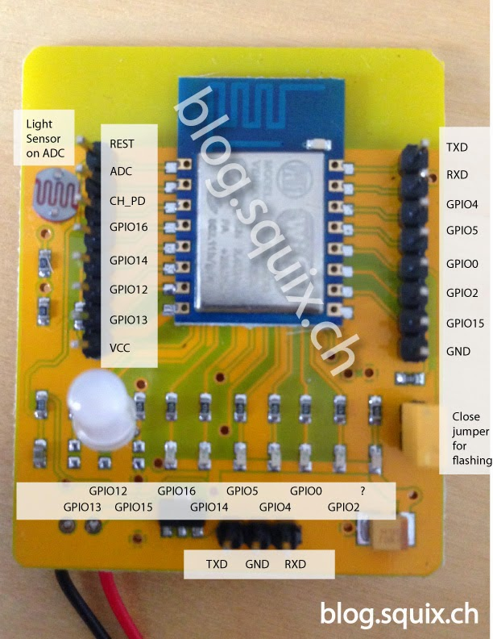

ESP-12E Development Board
=========================

Homepage
--------

http://espressif.com

Pinout
------

Drivers
-------

Supported drivers.

- :doc:`../library-reference/drivers/adc`
- :doc:`../library-reference/drivers/pin`
- :doc:`../library-reference/drivers/spi`
- :doc:`../library-reference/drivers/uart`

Mcu
---

:doc:`esp8266<../library-reference/mcus/esp8266>`

Default configuration
---------------------

Default Standard Library configuration.

+------------------------------------------------------+-----------------------------------------------------+
|  Name                                                |  Value                                              |
+======================================================+=====================================================+
|  CONFIG_ASSERT_                                      |  1                                                  |
+------------------------------------------------------+-----------------------------------------------------+
|  CONFIG_CONSOLE_                                     |  CONFIG_CONSOLE_UART                                |
+------------------------------------------------------+-----------------------------------------------------+
|  CONFIG_CONSOLE_DEVICE_INDEX_                        |  0                                                  |
+------------------------------------------------------+-----------------------------------------------------+
|  CONFIG_DEBUG_                                       |  1                                                  |
+------------------------------------------------------+-----------------------------------------------------+
|  CONFIG_FS_CMD_DS18B20_LIST_                         |  1                                                  |
+------------------------------------------------------+-----------------------------------------------------+
|  CONFIG_FS_CMD_FS_COUNTERS_LIST_                     |  1                                                  |
+------------------------------------------------------+-----------------------------------------------------+
|  CONFIG_FS_CMD_FS_COUNTERS_RESET_                    |  1                                                  |
+------------------------------------------------------+-----------------------------------------------------+
|  CONFIG_FS_CMD_FS_FILESYSTEMS_APPEND_                |  1                                                  |
+------------------------------------------------------+-----------------------------------------------------+
|  CONFIG_FS_CMD_FS_FILESYSTEMS_LIST_                  |  1                                                  |
+------------------------------------------------------+-----------------------------------------------------+
|  CONFIG_FS_CMD_FS_FILESYSTEMS_READ_                  |  1                                                  |
+------------------------------------------------------+-----------------------------------------------------+
|  CONFIG_FS_CMD_FS_FILESYSTEMS_WRITE_                 |  1                                                  |
+------------------------------------------------------+-----------------------------------------------------+
|  CONFIG_FS_CMD_FS_PARAMETERS_LIST_                   |  1                                                  |
+------------------------------------------------------+-----------------------------------------------------+
|  CONFIG_FS_CMD_I2C_READ_                             |  1                                                  |
+------------------------------------------------------+-----------------------------------------------------+
|  CONFIG_FS_CMD_I2C_WRITE_                            |  1                                                  |
+------------------------------------------------------+-----------------------------------------------------+
|  CONFIG_FS_CMD_LOG_LIST_                             |  1                                                  |
+------------------------------------------------------+-----------------------------------------------------+
|  CONFIG_FS_CMD_LOG_PRINT_                            |  1                                                  |
+------------------------------------------------------+-----------------------------------------------------+
|  CONFIG_FS_CMD_LOG_SET_LOG_MASK_                     |  1                                                  |
+------------------------------------------------------+-----------------------------------------------------+
|  CONFIG_FS_CMD_NETWORK_INTERFACE_LIST_               |  1                                                  |
+------------------------------------------------------+-----------------------------------------------------+
|  CONFIG_FS_CMD_PIN_READ_                             |  1                                                  |
+------------------------------------------------------+-----------------------------------------------------+
|  CONFIG_FS_CMD_PIN_SET_MODE_                         |  1                                                  |
+------------------------------------------------------+-----------------------------------------------------+
|  CONFIG_FS_CMD_PIN_WRITE_                            |  1                                                  |
+------------------------------------------------------+-----------------------------------------------------+
|  CONFIG_FS_CMD_SETTING_LIST_                         |  1                                                  |
+------------------------------------------------------+-----------------------------------------------------+
|  CONFIG_FS_CMD_SETTING_READ_                         |  1                                                  |
+------------------------------------------------------+-----------------------------------------------------+
|  CONFIG_FS_CMD_SETTING_RESET_                        |  1                                                  |
+------------------------------------------------------+-----------------------------------------------------+
|  CONFIG_FS_CMD_SETTING_WRITE_                        |  1                                                  |
+------------------------------------------------------+-----------------------------------------------------+
|  CONFIG_FS_CMD_SYS_INFO_                             |  1                                                  |
+------------------------------------------------------+-----------------------------------------------------+
|  CONFIG_FS_CMD_SYS_UPTIME_                           |  1                                                  |
+------------------------------------------------------+-----------------------------------------------------+
|  CONFIG_FS_CMD_THRD_LIST_                            |  1                                                  |
+------------------------------------------------------+-----------------------------------------------------+
|  CONFIG_FS_CMD_THRD_SET_LOG_MASK_                    |  1                                                  |
+------------------------------------------------------+-----------------------------------------------------+
|  CONFIG_FS_CMD_USB_DEVICE_LIST_                      |  1                                                  |
+------------------------------------------------------+-----------------------------------------------------+
|  CONFIG_FS_CMD_USB_HOST_LIST_                        |  1                                                  |
+------------------------------------------------------+-----------------------------------------------------+
|  CONFIG_MONITOR_THREAD_                              |  0                                                  |
+------------------------------------------------------+-----------------------------------------------------+
|  CONFIG_PREEMPTIVE_SCHEDULER_                        |  0                                                  |
+------------------------------------------------------+-----------------------------------------------------+
|  CONFIG_PROFILE_STACK_                               |  1                                                  |
+------------------------------------------------------+-----------------------------------------------------+
|  CONFIG_SHELL_COMMAND_MAX_                           |  64                                                 |
+------------------------------------------------------+-----------------------------------------------------+
|  CONFIG_SHELL_HISTORY_SIZE_                          |  768                                                |
+------------------------------------------------------+-----------------------------------------------------+
|  CONFIG_SHELL_MINIMAL_                               |  0                                                  |
+------------------------------------------------------+-----------------------------------------------------+
|  CONFIG_SHELL_PROMPT_                                |  "$ "                                               |
+------------------------------------------------------+-----------------------------------------------------+
|  CONFIG_STD_OUTPUT_BUFFER_MAX_                       |  16                                                 |
+------------------------------------------------------+-----------------------------------------------------+
|  CONFIG_SYSTEM_TICK_FREQUENCY_                       |  100                                                |
+------------------------------------------------------+-----------------------------------------------------+
|  CONFIG_SYS_CONFIG_STRING_                           |  1                                                  |
+------------------------------------------------------+-----------------------------------------------------+
|  CONFIG_USB_DEVICE_PID_                              |  0x8037                                             |
+------------------------------------------------------+-----------------------------------------------------+
|  CONFIG_USB_DEVICE_VID_                              |  0x2341                                             |
+------------------------------------------------------+-----------------------------------------------------+

Library Reference
----------------

Read more about board specific functionality in the :doc:`ESP-12E Development Board
<../library-reference/boards/esp12e>` module documentation in the
Library Reference.

.. include:: extra/esp12e.rst

.. _CONFIG_ASSERT: ../user-guide/configuration.html#c.CONFIG_ASSERT

.. _CONFIG_CONSOLE: ../user-guide/configuration.html#c.CONFIG_CONSOLE

.. _CONFIG_CONSOLE_DEVICE_INDEX: ../user-guide/configuration.html#c.CONFIG_CONSOLE_DEVICE_INDEX

.. _CONFIG_DEBUG: ../user-guide/configuration.html#c.CONFIG_DEBUG

.. _CONFIG_FS_CMD_DS18B20_LIST: ../user-guide/configuration.html#c.CONFIG_FS_CMD_DS18B20_LIST

.. _CONFIG_FS_CMD_FS_COUNTERS_LIST: ../user-guide/configuration.html#c.CONFIG_FS_CMD_FS_COUNTERS_LIST

.. _CONFIG_FS_CMD_FS_COUNTERS_RESET: ../user-guide/configuration.html#c.CONFIG_FS_CMD_FS_COUNTERS_RESET

.. _CONFIG_FS_CMD_FS_FILESYSTEMS_APPEND: ../user-guide/configuration.html#c.CONFIG_FS_CMD_FS_FILESYSTEMS_APPEND

.. _CONFIG_FS_CMD_FS_FILESYSTEMS_LIST: ../user-guide/configuration.html#c.CONFIG_FS_CMD_FS_FILESYSTEMS_LIST

.. _CONFIG_FS_CMD_FS_FILESYSTEMS_READ: ../user-guide/configuration.html#c.CONFIG_FS_CMD_FS_FILESYSTEMS_READ

.. _CONFIG_FS_CMD_FS_FILESYSTEMS_WRITE: ../user-guide/configuration.html#c.CONFIG_FS_CMD_FS_FILESYSTEMS_WRITE

.. _CONFIG_FS_CMD_FS_PARAMETERS_LIST: ../user-guide/configuration.html#c.CONFIG_FS_CMD_FS_PARAMETERS_LIST

.. _CONFIG_FS_CMD_I2C_READ: ../user-guide/configuration.html#c.CONFIG_FS_CMD_I2C_READ

.. _CONFIG_FS_CMD_I2C_WRITE: ../user-guide/configuration.html#c.CONFIG_FS_CMD_I2C_WRITE

.. _CONFIG_FS_CMD_LOG_LIST: ../user-guide/configuration.html#c.CONFIG_FS_CMD_LOG_LIST

.. _CONFIG_FS_CMD_LOG_PRINT: ../user-guide/configuration.html#c.CONFIG_FS_CMD_LOG_PRINT

.. _CONFIG_FS_CMD_LOG_SET_LOG_MASK: ../user-guide/configuration.html#c.CONFIG_FS_CMD_LOG_SET_LOG_MASK

.. _CONFIG_FS_CMD_NETWORK_INTERFACE_LIST: ../user-guide/configuration.html#c.CONFIG_FS_CMD_NETWORK_INTERFACE_LIST

.. _CONFIG_FS_CMD_PIN_READ: ../user-guide/configuration.html#c.CONFIG_FS_CMD_PIN_READ

.. _CONFIG_FS_CMD_PIN_SET_MODE: ../user-guide/configuration.html#c.CONFIG_FS_CMD_PIN_SET_MODE

.. _CONFIG_FS_CMD_PIN_WRITE: ../user-guide/configuration.html#c.CONFIG_FS_CMD_PIN_WRITE

.. _CONFIG_FS_CMD_SETTING_LIST: ../user-guide/configuration.html#c.CONFIG_FS_CMD_SETTING_LIST

.. _CONFIG_FS_CMD_SETTING_READ: ../user-guide/configuration.html#c.CONFIG_FS_CMD_SETTING_READ

.. _CONFIG_FS_CMD_SETTING_RESET: ../user-guide/configuration.html#c.CONFIG_FS_CMD_SETTING_RESET

.. _CONFIG_FS_CMD_SETTING_WRITE: ../user-guide/configuration.html#c.CONFIG_FS_CMD_SETTING_WRITE

.. _CONFIG_FS_CMD_SYS_INFO: ../user-guide/configuration.html#c.CONFIG_FS_CMD_SYS_INFO

.. _CONFIG_FS_CMD_SYS_UPTIME: ../user-guide/configuration.html#c.CONFIG_FS_CMD_SYS_UPTIME

.. _CONFIG_FS_CMD_THRD_LIST: ../user-guide/configuration.html#c.CONFIG_FS_CMD_THRD_LIST

.. _CONFIG_FS_CMD_THRD_SET_LOG_MASK: ../user-guide/configuration.html#c.CONFIG_FS_CMD_THRD_SET_LOG_MASK

.. _CONFIG_FS_CMD_USB_DEVICE_LIST: ../user-guide/configuration.html#c.CONFIG_FS_CMD_USB_DEVICE_LIST

.. _CONFIG_FS_CMD_USB_HOST_LIST: ../user-guide/configuration.html#c.CONFIG_FS_CMD_USB_HOST_LIST

.. _CONFIG_MONITOR_THREAD: ../user-guide/configuration.html#c.CONFIG_MONITOR_THREAD

.. _CONFIG_PREEMPTIVE_SCHEDULER: ../user-guide/configuration.html#c.CONFIG_PREEMPTIVE_SCHEDULER

.. _CONFIG_PROFILE_STACK: ../user-guide/configuration.html#c.CONFIG_PROFILE_STACK

.. _CONFIG_SHELL_COMMAND_MAX: ../user-guide/configuration.html#c.CONFIG_SHELL_COMMAND_MAX

.. _CONFIG_SHELL_HISTORY_SIZE: ../user-guide/configuration.html#c.CONFIG_SHELL_HISTORY_SIZE

.. _CONFIG_SHELL_MINIMAL: ../user-guide/configuration.html#c.CONFIG_SHELL_MINIMAL

.. _CONFIG_SHELL_PROMPT: ../user-guide/configuration.html#c.CONFIG_SHELL_PROMPT

.. _CONFIG_STD_OUTPUT_BUFFER_MAX: ../user-guide/configuration.html#c.CONFIG_STD_OUTPUT_BUFFER_MAX

.. _CONFIG_SYSTEM_TICK_FREQUENCY: ../user-guide/configuration.html#c.CONFIG_SYSTEM_TICK_FREQUENCY

.. _CONFIG_SYS_CONFIG_STRING: ../user-guide/configuration.html#c.CONFIG_SYS_CONFIG_STRING

.. _CONFIG_USB_DEVICE_PID: ../user-guide/configuration.html#c.CONFIG_USB_DEVICE_PID

.. _CONFIG_USB_DEVICE_VID: ../user-guide/configuration.html#c.CONFIG_USB_DEVICE_VID
