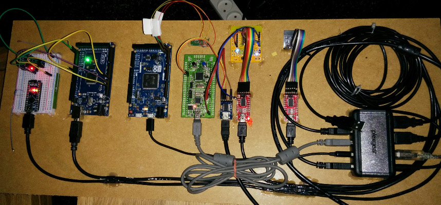

Testing
=======

Hardware
--------

Below is a picture of all supported boards connected to a USB hub. The
USB hub is connected to a linux PC (not in the picture) that executes
test suites on all boards.

   The boards are (from left to right): :doc:`../boards/arduino_nano`,
   :doc:`../boards/arduino_mega`, :doc:`../boards/arduino_due`,
   :doc:`../boards/stm32vldiscovery`, :doc:`../boards/esp12e` and
   :doc:`../boards/esp01`

The DS3231 device (on the breadboard to the left) is connected over
i2c to the :doc:`../boards/arduino_mega`.

CAN0 is connected to CAN1 on the :doc:`../boards/arduino_due`. The CAN
driver is tested by sending frames between the two CAN devices.

The UART of the :doc:`../boards/stm32vldiscovery` board is connected
to a serial to USB adaptor. DTR on the adaptor is used to reset the
board.

The :doc:`../boards/esp12e` also has a serial to USB adaptor
connected. RTS is used to set the board in flashing mode (GPIO 0) and
DTR is used to reset the board (REST).
