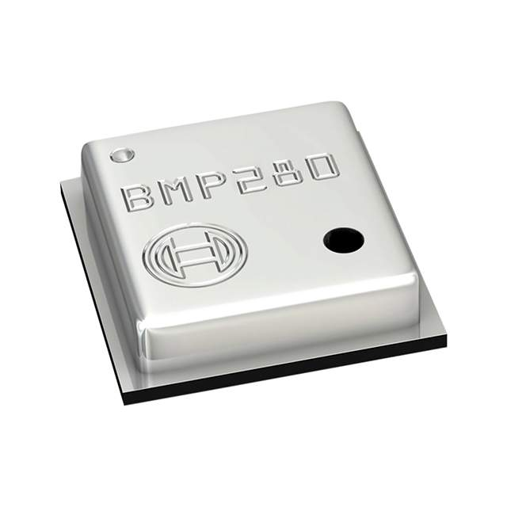

:mod:`bmp280` --- BMP280 temperature and pressure sensor
========================================================

.. module:: bmp280
   :synopsis: BMP280 temperature and pressure sensor.

BMP280 is a temperature and pressure sensor from Bosch Sensortec.

This driver supports both I2C and SPI for device communication.

Datasheet: `Datasheet BMP280`_

----------------------------------------------

Source code: :github-blob:`src/drivers/bmp280.h`, :github-blob:`src/drivers/bmp280.c`

Test code: :github-blob:`tst/drivers/software/bmp280/main.c`

----------------------------------------------

.. doxygenfile:: drivers/bmp280.h
   :project: simba

.. _Datasheet BMP280: https://github.com/eerimoq/hardware-reference/raw/master/Bosch%20Sensortec/BST-BMP280-DS001-11.pdf
