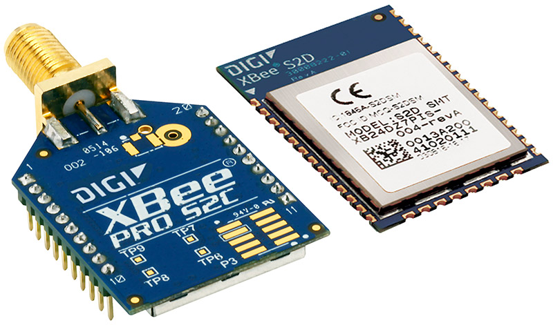

:mod:`xbee` --- XBee
====================

.. module:: xbee
   :synopsis: Xbee.

An XBee is a module for wireless communication.

This driver implements reception and transmission of frames over a
channel (normally a UART driver).

Known limitations:

- Only AP=2 is supported. That is, API operation with escaped
  charaters. AP=1 could easily be implemented.

Manufacturer homepage: https://www.digi.com/

--------------------------------------------------

Source code: :github-blob:`src/drivers/network/xbee.h`, :github-blob:`src/drivers/network/xbee.c`

Test code: :github-blob:`tst/drivers/software/network/xbee/main.c`

Test coverage: :codecov:`src/drivers/network/xbee.c`

Example code: :github-blob:`examples/xbee/main.c`

--------------------------------------------------

.. doxygenfile:: drivers/network/xbee.h
   :project: simba
