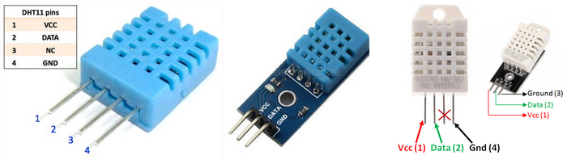
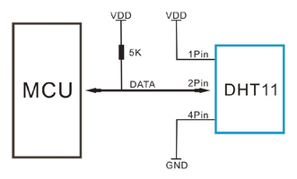

:mod:`dht` --- DHT temperature and humidity sensor
==================================================

.. module:: dht
   :synopsis: DHT temperature and humidity sensor.

DHT is temperature and humidity sensor. The two most popular versions
are DHT11 (blue) and DHT22 (white).

Both versions are available in bare sensor and module variants. The
bare sensor has four pins, while the module only has three. According
to the datasheet, the data pin should be connected to VCC via a 5k
pull-up resistor. The pull-up resistor is only needed for the bare
sensor, as the module already has a built-in pull-up resistor.

Source code: :github-blob:`src/drivers/sensors/dht.h`,
:github-blob:`src/drivers/sensors/dht.c`

Example code: :github-blob:`examples/dht/main.c`

----------------------------------------------

.. doxygenfile:: drivers/sensors/dht.h
   :project: simba
