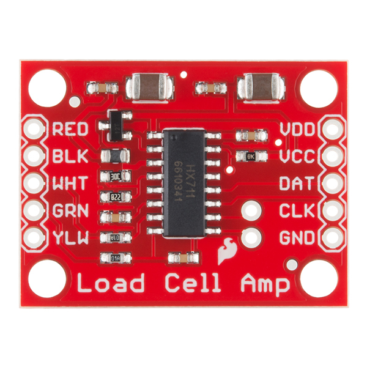

:mod:`hx711` --- HX711 ADC for weigh scales
===========================================

.. module:: hx711
   :synopsis: HX711 ADC for weigh scales.

The HX711 chipset performs ADC convertions on weigh scales. It can be
used to measure weight in various ranges.

This driver provides methods to read ADC samples from given channel
with given gain.

Example usage
-------------

This is a small example illustrating how to read one sample from each
channel and gain combination.

.. code-block:: c

   struct hx711_driver_t hx711;
   float weight_a_128;
   float weight_a_64;
   float weight_b_32;

   /* Initialize and start the deivce. */
   hx711_init(&hx711, &pin_d2_dev, &pin_d3_dev, 1.0, 0.0);
   hx711_start(&hx711);

   /* Read a few samples from the device. */
   hx711_read(&hx711, &weight_a_128, hx711_channel_gain_a_128_t);
   hx711_read(&hx711, &weight_a_64, hx711_channel_gain_a_64_t);
   hx711_read(&hx711, &weight_b_32, hx711_channel_gain_b_32_t);

   /* Print the samples. */
   std_printf(OSTR("weight_a_128: %f, weight_a_64: %f, weight_b_32: %f\r\n"),
              weight_a_128,
              weight_a_64,
              weight_b_32);

   /* Stop the deivce. */
   hx711_stop(&hx711);

--------------------------------------------------

Source code: :github-blob:`src/drivers/sensors/hx711.h`, :github-blob:`src/drivers/sensors/hx711.c`

Test code: :github-blob:`tst/drivers/software/sensors/hx711/main.c`

Test coverage: :codecov:`src/drivers/sensors/hx711.c`

Example code: :github-blob:`examples/hx711/main.c`

--------------------------------------------------

.. doxygenfile:: drivers/sensors/hx711.h
   :project: simba
