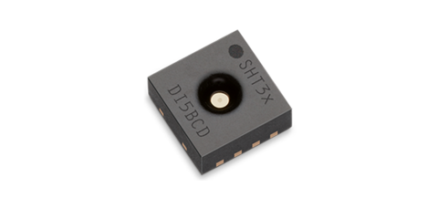

:mod:`sht3xd` --- SHT3x-D Humidity and Temperature Sensor
=========================================================

.. module:: sht3xd
   :synopsis: SHT3x-D Humidity and Temperature Sensor

The `Sensirion SHT3x-D`_ is a series of digital of Humidity and
Temperature Sensors.  This driver supports the SHT30-D, SHT31-D, and
SHT35-D using an I2C interface.  The analog SHT3x-A, such as SHT30-A
and SHT31-A are not supported.

The SHT3x-D sensors supports I2C speed of up to 1MHz.

Current limitations of this driver:

* Only supports basic functionality and high repeatability mode.
* Does not perform check CRC of sensor result.

Datasheet: `Datasheet SHT3x-DIS`_

Source code: :github-blob:`src/drivers/sensors/sht3xd.h`,
:github-blob:`src/drivers/sensors/sht3xd.c`

----------------------------------------------

.. doxygenfile:: drivers/sensors/sht3xd.h
   :project: simba

.. _Sensirion SHT3x-D: https://www.sensirion.com/environmental-sensors/humidity-sensors/digital-humidity-sensors-for-various-applications/
.. _Datasheet SHT3x-DIS: https://www.sensirion.com/fileadmin/user_upload/customers/sensirion/Dokumente/2_Humidity_Sensors/Sensirion_Humidity_Sensors_SHT3x_Datasheet_digital.pdf
