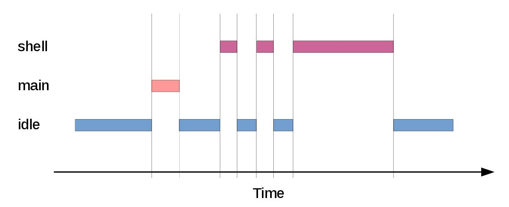

:mod:`thrd` --- Threads
=======================

.. module:: thrd
   :synopsis: Threads.

A thread is the basic execution entity in the OS. A pre-emptive or
cooperative scheduler controls the execution of threads.

Scheduler
---------

The single core scheduler is configured as cooperative or preemptive
at compile time. The cooperative scheduler is implemented for all
boards, but the preemptive scheduler is only implemented for a few
boards.

There are two threads that are always present; the main thread and the
idle thread. The main thread is the root thread in the system, created
in the ``main()`` function by calling ``sys_start()``. The idle thread
is running when no other thread is ready to run. It simply waits for
an interrupt to occur and then reschedules to run other ready threads.

The diagram below is an example of how three threads; ``shell``,
``main`` and ``idle`` are scheduled over time.

As it is a single core scheduler only one thread is runnng at a
time. In the beginning the system is idle and the ``idle`` thread is
running. After a while the ``main`` and ``shell`` threads have some
work to do, and since they have higher priority than the ``idle``
thread they are scheduled. At the end the ``idle`` thread is running
again.

Debug file system commands
--------------------------

Four debug file system commands are available, all located in the
directory ``kernel/thrd/``.

+----------------------------------------+----------------------------------------------------------------+
|  Command                               | Description                                                    |
+========================================+================================================================+
|  ``list``                              | Print a list of all threads.                                   |
+----------------------------------------+----------------------------------------------------------------+
|  ``set_log_mask <thread name> <mask>`` | Set the log mask of thread ``<thread name>`` to ``mask``.      |
+----------------------------------------+----------------------------------------------------------------+
|  ``monitor/set_period_ms <ms>``        | Set the monitor thread sampling period to ``<ms>`` |br|        |
|                                        | milliseconds.                                                  |
+----------------------------------------+----------------------------------------------------------------+
|  ``monitor/set_print <state>``         | Enable(``1``)/disable(``0``) monitor statistics to be |br|     |
|                                        | printed periodically.                                          |
+----------------------------------------+----------------------------------------------------------------+

Example output from the shell:

.. code-block:: text

   $ kenel/thrd/list
               NAME        STATE  PRIO   CPU   SCHEDULED  LOGMASK
               main      current     0    0%           1     0x0f
                           ready   127    0%           0     0x0f
                           ready   -80    0%           0     0x0f

----------------------------------------------

Source code: :github-blob:`src/kernel/thrd.h`, :github-blob:`src/kernel/thrd.c`

Test code: :github-blob:`tst/kernel/thrd/main.c`

Test coverage: :codecov:`src/kernel/thrd.c`

----------------------------------------------

.. doxygenfile:: kernel/thrd.h
   :project: simba

.. |br| raw:: html

    
