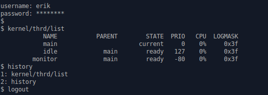

:mod:`shell` --- Debug shell
============================

.. module:: shell
   :synopsis: Debug shell.

The shell is a command line interface where the user can execute
various commands to control, debug and monitor its application.

The shell module has a few configuration variables that can be used to
tailor the shell to the application requirements. Most noticeably is
the configuration variable ``CONFIG_SHELL_MINIMAL``. If set to ``0``
all the shell functionality is built; including tab completion, cursor
movement, line editing and command history. If set to ``1`` only the
minimal functionality is built; only including tab completion and line
editing at the end of the line.

See :doc:`../../user-guide/configuration` for a list of all
configuration variables.

----------------------------------------------

Source code: :github-blob:`src/oam/shell.h`, :github-blob:`src/oam/shell.c`

Test code: :github-blob:`tst/oam/shell/main.c`

Test coverage: :codecov:`src/oam/shell.c`

Example code: :github-blob:`examples/shell/main.c`

----------------------------------------------

.. doxygenfile:: oam/shell.h
   :project: simba
