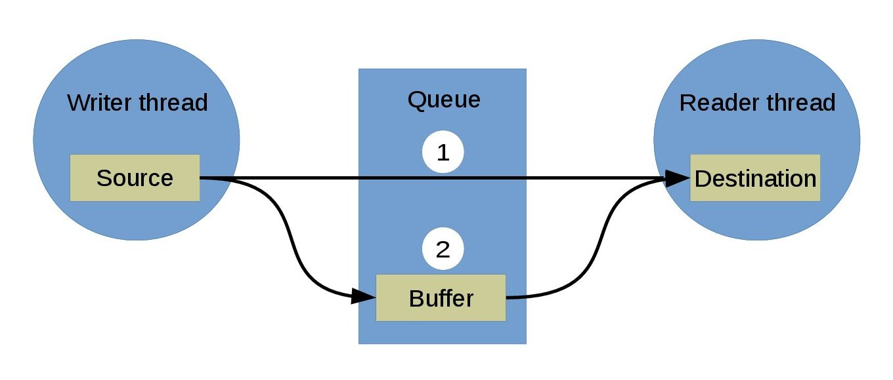

:mod:`queue` --- Queue channel
==============================

.. module:: queue
   :synopsis: Queue channel.

The most common channel is the queue. It can be either synchronous or
semi-asynchronous. In the synchronous version the writing thread will
block until all written data has been read by the reader. In the
semi-asynchronous version the writer writes to a buffer within the
queue, and only blocks all data does not fit in the buffer. The buffer
size is selected by the application when initializing the queue.

The diagram below shows how two threads communicates using a
queue. The writer thread writes from its source buffer to the
queue. The reader thread reads from the queue to its destination
buffer.

The data is either copied directly from the source to the destination
buffer (1. in the figure), or via the internal queue buffer (2. in the
figure).

1. The reader thread is waiting for data. The writer writes from its
   source buffer directly to the readers' destination buffer.

2. The reader thread is *not* waiting for data. The writer writes from
   its source buffer into the queue buffer. Later, the reader reads
   data from the queue buffer to its destination buffer.

----------------------------------------------

Source code: :github-blob:`src/sync/queue.h`, :github-blob:`src/sync/queue.c`

Test code: :github-blob:`tst/sync/queue/main.c`

Test coverage: :codecov:`src/sync/queue.c`

Example code: :github-blob:`examples/queue/main.c`

----------------------------------------------

.. doxygenfile:: sync/queue.h
   :project: simba
