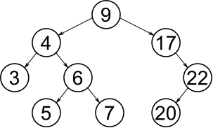

:mod:`binary_tree` --- Binary tree
==================================

.. module:: binary_tree
   :synopsis: Binary tree.

A binary search tree consists of nodes, where each node has zero, one
or two siblings. The left sibling has a lower value and the right
sibling has a higher value than the parent.

Insert, delete and search operations all have the time complexity of
O(log n).

----------------------------------------------

Source code: :github-blob:`src/collections/binary_tree.h`, :github-blob:`src/collections/binary_tree.c`

Test code: :github-blob:`tst/collections/binary_tree/main.c`

Test coverage: :codecov:`src/collections/binary_tree.c`

----------------------------------------------

.. doxygenfile:: collections/binary_tree.h
   :project: simba
