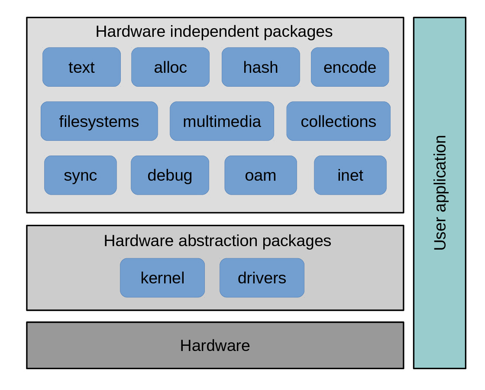

User Guide
==========

This guide is intended for users of the Simba Embedded Programming
Platform and the `Simba build system`. Parts of the guide is
applicable to other build systems as well, in particular the
configuration section.

The Simba installation guide can be found on the
:doc:`getting-started` page.

Software architecture
---------------------

Below is a picture of all packages and their relation to the
hardware. At the bottom is the hardware. On top of the hardware is the
kernel and drivers packages, which exports a hardware independent
interface that other packages and the user application can use. The
user application on the right can use any package, and in rare cases
directly access the hardware registers.

**Contents:**

.. toctree::
   :glob:   
   :maxdepth: 1

   user-guide/environment-setup
   user-guide/hello-world-application
   user-guide/applications-packages-and-modules
   user-guide/configuration
   user-guide/build-system
   user-guide/simba
